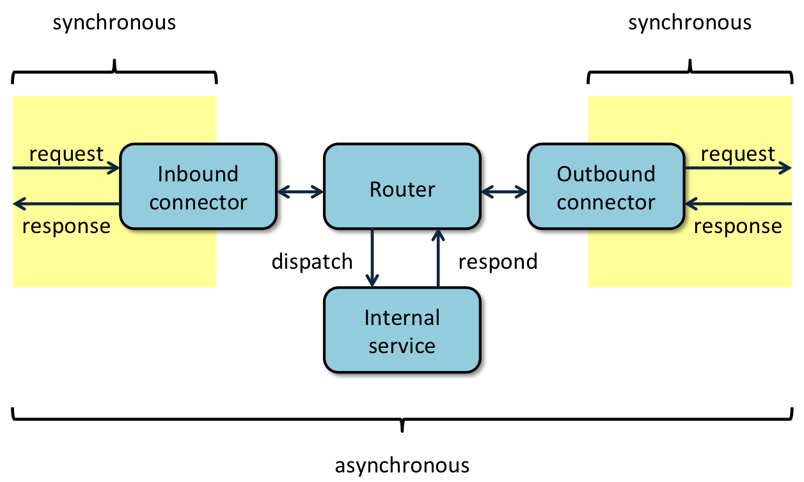

# Connectors

## Connectors vs Adapters
In the context of the iCargo IT architecture, connectors are software components that implement the [adapter pattern](https://en.wikipedia.org/wiki/Adapter_pattern) to transform a specific communication protocol into an internal protocol and vice versa. Connectors only transform the data but they don’t interpret or translate it. The term “*adapters*” will be used to address software components that interpret data based on a given context and also implement the [adapter pattern](https://en.wikipedia.org/wiki/Adapter_pattern). An *adapter* can be implemented as a sequence of software services where a connector can be one of the software services to acquire input or to deliver output.

As part of a workflow mechanism, connectors can be implemented as software services at the beginning or at the end of a pipeline of software services. With use of a routing software service, the received data can be dispatch to another software service for processing. After processing or in case of forwarding, data can be routed to an outbound connector.

## Synchrone vs Asynchrone
Synchronous responses are returned by the same inbound or outbound connector who respectively received the request or initiated the request. (See figure above). For example, the result of an HTTP GET request can be implemented as a synchronous response in case the information is available at hand. In case the required activities to provide the information require a lot of internal or even external resources, an asynchronous response can be a better solution from a performance point of view. A synchronous response that the request has been properly received could be returned, while the requested information is sent over later.

An asynchronous response is always a request to another software service via an *outbound connector*. This request might require a synchronous response from the recipient of the request, to confirm whether the request has be handled according expectations.

The specification of the iCargo REST API will use the concepts of *synchrone* and *asynchrone* responses according to the explanation above.